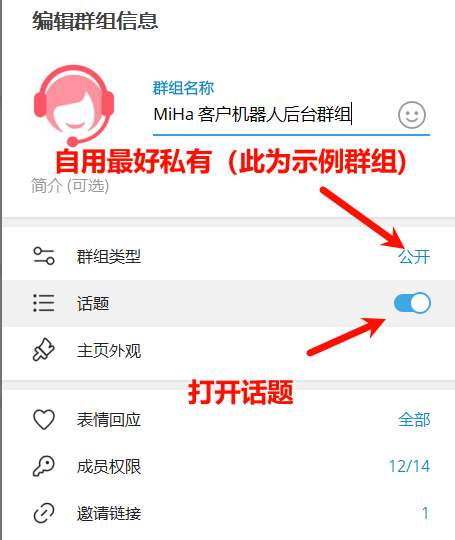
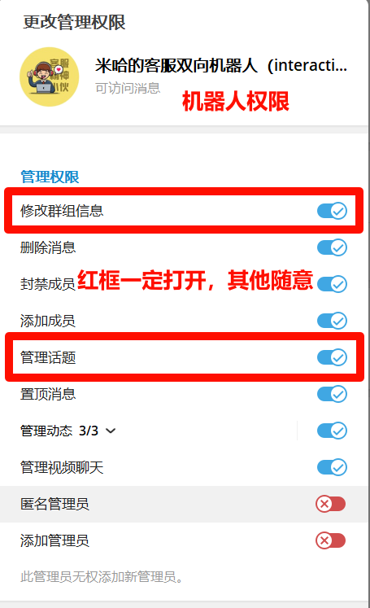

# Telegram interactive bot (Telegram 双向机器人)

## 一、简介
Telegram的开源双向机器人。避免垃圾信息；让被限制的客户可以顺利联系到你。
支持后台多客服。在后台群组，可以安排多个客服以同一个机器人身份持续和客户沟通。

[English](https://github.com/MiHaKun/Telegram-interactive-bot/blob/master/README.en.md) | [示例机器人](https://t.me/CustomerConnectBot) | [示例后台](https://t.me/MiHaCMSGroup)

（ps：和示例机器人说话后，去后台看看，就大概知道原理了）

（ps：示例后台是公开群组，方便大家看效果而已。自己部署，最好用私有群组，安全性还是没问题的）


### 特色
- 当客户通过机器人联系客服时，所有消息将被完整转发到后台管理群组，生成一个独立的以客户信息命名子论坛，用来和其他客户区分开来。
- 客服在子论坛中的回复，可以直接回复给客户。
- 客服可以通过关闭/开启子论坛来配置是否继续和客户对话。
- 提供永久封禁方案。env内有开关。
- 提供 /clear 命令，可以清除子论坛内的所有消息，同时也删除用户消息（极其不推荐如此使用，不过奈何也确实有时候有必要）。env内有开关。

### 优势
- 借助子论坛，可以增加多个管理成员，分担客服压力。
- 可以直观的保留和客户沟通的完整通讯记录。
- 可以得知某句话是哪个客服回复的，维系连贯的客户服务。


## 二、准备工作
本机器人的主要原理是将客户和机器人的对话，转发到一个群内（自用，最好是私有群），并归纳每个客户的消息到一个子版块。
所以，在开工前，你需要：
1. 找 @BotFather 申请一个机器人。

2. 获取机器人的token

3. 建立一个群组（按需设置是否公开）

4. 群组的“话题功能”打开。

5. 将自己的机器人，拉入群组。提升权限为管理员。

6. 管理权限切记包含`消息管理`，`话题管理`。

7. 通过机器人 @GetTheirIDBot 获取群组的内置ID和管理员用户ID。

   

## 三、部署运行

### 1. 修改env
打开`.env_example`，将自己机器人的Token、账号的API_ID/HASH、管理群组ID和管理员ID补全。
另存`.env_example`为`.env`

### 2. 获取代码/构建python venv
```
git clone https://github.com/MiHaKun/Telegram-interactive-bot.git
cd Telegram-interactive-bot
python3 -m venv venv
. venv/bin/activate
pip install -r requirements.txt
```
### 3. 执行启动
```
python -m interactive-bot
```

**PS:** 正式运营，还是需要类似`PM2`、`supervisor`之类的进程管理工具，配合看门狗来实现不间断运行、自动重启、失效重启等功能。 


# ToDoList
- [ ] 准备完善下，docker化
- [x] 支持消息回复功能。消息间可以相互引用。
- [x] 完善下数据库。
- [x] 添加客户的人机识别，防止无聊的人用userbot来刷
- [x] 添加并识别媒体组消息。
- [x] 精简点代码，利用**payload来展开forwarding的参数。

# 关于

- 本产品基于Apache协议开源。
- 作者 米哈( [@MrMiHa](https://t.me/MrMiHa) )是一个苦逼程序员，不是煤场奴工，有问题别太理直气壮的跑来下命令。
- 讨论群组是 : https://t.me/DeveloperTeamGroup 欢迎加入后玩耍
- 随意Fork，记得保留`关于`的内容。
- 初版写了2小时。喜欢请打赏。不会部署，群里找我。
- 服务器推荐RackNerd的。实际上，我也确实用这个。够便宜。这款就够：[2核3G--年27刀](https://my.racknerd.com/aff.php?aff=11705&pid=828) 
- 实在搞不定部署，可以群里找大家帮忙部署下。服务器也可以找大家共用： https://t.me/DeveloperTeamGroup 
- 实在实在实在搞不定部署，找  [@MrMiHa](https://t.me/MrMiHa)  同学付费部署……

# 详细部署文档

[米哈同学的知识库](https://miha.uk/docs/tutor/telegram-interactive-bot/)
